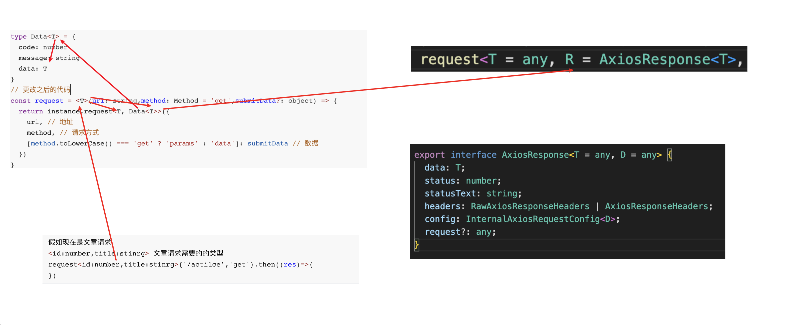

# consult-patient-h5

This template should help get you started developing with Vue 3 in Vite.

## Recommended IDE Setup

[VSCode](https://code.visualstudio.com/) + [Volar](https://marketplace.visualstudio.com/items?itemName=Vue.volar) (and disable Vetur) + [TypeScript Vue Plugin (Volar)](https://marketplace.visualstudio.com/items?itemName=Vue.vscode-typescript-vue-plugin).

## Type Support for `.vue` Imports in TS

TypeScript cannot handle type information for `.vue` imports by default, so we replace the `tsc` CLI with `vue-tsc` for type checking. In editors, we need [TypeScript Vue Plugin (Volar)](https://marketplace.visualstudio.com/items?itemName=Vue.vscode-typescript-vue-plugin) to make the TypeScript language service aware of `.vue` types.

If the standalone TypeScript plugin doesn't feel fast enough to you, Volar has also implemented a [Take Over Mode](https://github.com/johnsoncodehk/volar/discussions/471#discussioncomment-1361669) that is more performant. You can enable it by the following steps:

1. Disable the built-in TypeScript Extension
    1) Run `Extensions: Show Built-in Extensions` from VSCode's command palette
    2) Find `TypeScript and JavaScript Language Features`, right click and select `Disable (Workspace)`
2. Reload the VSCode window by running `Developer: Reload Window` from the command palette.

## Customize configuration

See [Vite Configuration Reference](https://vitejs.dev/config/).

## Project Setup

```sh
pnpm install
```

### Compile and Hot-Reload for Development

```sh
pnpm dev
```

### Type-Check, Compile and Minify for Production

```sh
pnpm build
```

### Lint with [ESLint](https://eslint.org/)

```sh
pnpm lint
```
### 项目文件(其他文件)
```typescript
.vscode - vscode推荐插件
node_modules - 项目依赖包
pubilc - 打包后放入的文件
.eslintrc.cjs - EsLint配置文件
.gitignore - git忽略文件
.prettierrc.json - Prettier配置文件
env.d.ts - Typescript类型支持文件
index.html - 唯一HTML文件
package.json - 依赖包(版本)
pnpm-lock.yaml - pnpm(包管理工具)
postcss.config.js - 移动端适配
README.md - 项目说明文件
tsconfig.config.json - Typescript依赖包管理文件
tsconfig.json - Typescript依赖包管理文件
vite.config.js - wepack配置文件
```
### 项目文件(src文件)
```typescript
assets - 静态资源(也可能包括css代码)
components - 全局通用组件(重复的组件)
    CpNavBar.vue - 顶部导航栏
    CpIcon.vue - Icon组件(svg)
    CpRadioBtn.vue - 单选按钮(很多页面中,都用到了)
composable - 组合式功能通用函数(Hooks)
enums - 枚举(枚举的值经常需要在运行的时候使用)
icons - svg图标(使用插件打包成一个文件)
router - 路由
    index.ts - 路由配置
services - 接口相关(API)
    user.ts - 用户相关的接口请求
    consult.ts - 文章相关的接口请求
store - Pinia(状态管理)
		modules - 所有模块(不需要注册模化,只是文件分配合适才创建的)
    		user.ts - 用户相关模块
        consult.ts - 记录病情模块(也就是点击极速问诊的每一步操作进行记录)
    index.ts - Pinia配置注册(统一导出,导入路径时少一层路径)
styles - 全局样式
    main.scss - 项目共用样式
types - Typescript类型
		user.d.ts - 用户相关的类型声明
    components.d.ts - 给组件声明类型
    consult.d.ts - 文章相关的类型声明
    vue-router.vue - 给vue-routers声明类型
utils - 工具函数
    request.ts - 请求工具(二次封装axios)
    rules.ts - 表单校验
views - 路由页面
    Consult - 问诊(点击极速问诊)
      ConsultFast.vue - 极速问诊页面 
      ConsultDep.vue - 选择科室
      ConsultIllness.vue - 图文问诊
    Layout - 布局容器(二级路由展示区在上方,下方是导航栏)
      index.vue - 布局
    Login - 登录页面
    Article - 健康百科(没有进行开发)
    Home - 首页
      components - 首页公用组件
        KnowledgeList.vue(每条新闻的布局容器(渲染的也是它))
        KnowledgeCard.vue(每条新闻)
        FollowDoctor.vue(推荐关注医生的结构-框架)
        DoctorCard.vue(每个医生卡片)
      index.vue - 首页布局
    Notify - 消息通知(没有进行开发)
    User - 个人信息页面
      index.vue - 个人信息页面布局
      PatientPage.vue - 家庭档案
App.vue - 根组件
main.ts - 入口文件
```
### 路由相关
```type
使用createRouter来创建路由
createWebHistory 没有 #号的
createWebHashHistory 存在 #号的
两者都需要引入
createWebHistory(import.meta.env.BASE_URL) 
这个值来自 vite.config.ts 的 base 属性的值
需要配置,默认是 /
路由的基准路径
假如是 '/abc' 
整个项目的所有路径前都有 '/abc'
```
### 项目使用的依赖
```typescript
scss - css预处理语言
pinia - 状态管理
pinia-plugin-persistedstate - Pinia持久化存储((默认是localStorage))
vant - ui组件库
postcss-px-to-viewport - px转vw(移动端适配)
axios - 请求工具
unplugin-vue-components - ui组件自动按需加载
vite-plugin-svg-icons - 将(icons文件下的svg)打包成一个文件(格式:icon-login-eye-off)
nprogress - 进度条
```

### axios封装请求函数

> 没有类型时的请求函数

```typescript
const request = (url: string, method: string, submitData: object) => {
  return instance.request({
    url,
    method, 
    [method.toLowerCase() === 'get' ? 'params' : 'data']: submitData 
  })
}
```

> 存在类型
>
> 泛型

```typescript
// 没有类型时,不合适的点
method的类型时stirng,传递什么普通字符串都可以
// 使用axios,自带的类型 Method
axios规定了只能写一些请求方式:get post delete put...
// 配置
method的默认是get请求
submitData不是所有都是提交数据,所以是可选的 "?"
// 返回的数据类型
type Data<T> = { // 接收传递的类型
  code: number
  message: string
  data: T // 使用传递的数据类型(文件中使用请求的数据时,会有良好的提示效果)
}
// 更改之后的代码
// 这个T是函数接收的类型
const request = <T>(url: string,method: Method = 'get',submitData?: object) => {
                 // 第一个T 是接收数据的类型(没有什么用)
                 // 第二个T 也是接收数据的类型,同时替换axios默认的数据类型
  return instance.request<T, Data<T>>({
    url, // 地址
    method, // 请求方式
    [method.toLowerCase() === 'get' ? 'params' : 'data']: submitData // 数据
  })
}
```

```typescript
假如现在是文章请求
<id:number,title:stinrg> 文章请求需要的的类型
request<id:number,title:stinrg>{'/actilce','get'}.then((res)=>{
})
```

```javascript
R = AxiosResponse<T> 是axios默认的数据类型,但是现在不需要它的默认类型
Date<T> 就是后台响应的数据类型
直接Pormise返回
```

### 路由
```javascript
存在下方标签栏的是二级路由
整个页面发生切换,也就是说没有下方的标签栏栏,就是一级路由
```javascript
### 全局注册组件
>如果使用了unplugin-vue-components,会自动导入组件
>而且components中的组件,也会自动导入
```
### 导航守卫
>Vue3中的导航守卫没有next,使用return true ｜ 什么也不写
>如果拦截某个页面 return '路由地址'

### 单选框的封装逻辑分析
>假如单选框传递的是 男 ｜ 女 - 默认是男被选中
```javascript
// 父组件
// 准备传递的数据和被默认选中的值
const options = [
  { label: '男', value: 1 },
  { label: '女', value: 0 }
]
const gender = ref(1)
// 多个数据传递
<cp-radio-btn :options="options" :model-value="patient.gender" @update:model-value="patient.gender = $event as number" /> 
// 简写方式
// v-model 相当于直接做传递值的,修改值的操作
<cp-radio-btn v-model="patient.gender" :options="options"></cp-radio-btn>
```
```javascript
// 子组件
defineProps<{
  options: {
    label: string // 接收(男,女的文字)
    value: number | string // (接收0和1)
  }[]
  modelValue?: string | number // 接收谁被选中
}>()
// 修改父组件的值
const emit = defineEmits<{
  // 事件名称和最新的值,传递给父组件
  (e: 'update:modelValue', value: number | string): void
}>()
// 循环创建接收的文字,并触发自定义事件
<a :class="{ active: modelValue === item.value }" v-for="item in options":key="item.value"
@click="emit('update:modelValue', item.value)">{{ item.label }}</a>
```
### 一些问题
>推荐关注医生
>使用vant的轮播图,每次滑动的宽度是150
>就会导致如果,屏幕不在375的设备下,可能会出现很多卡片叠在一起的情况
>需要动态的设置滑动的宽度
>>原生解决(只解决了竖屏)
```javascript
const width = ref(0)
const setWidth = () => (width.value = (150 / 375) * window.innerWidth)
onMounted(() => {
  setWidth()
  // 当触发resize(当浏览器发生改变时触发)时,重新调用setWidth函数
  window.addEventListener('resize', setWidth)
})
onUnmounted(() => {
  window.removeEventListener('resize', setWidth)
})
```
>>解决方式:使用VueUse的 'useWindowSize' 来解决
```javascript
import { useWindowSize } from '@vueuse/core'
const { width } = useWindowSize()
:width="(150 / 375) * width" 
( 滑块的宽度 / 设备的宽度) * 当前设备的宽度
```